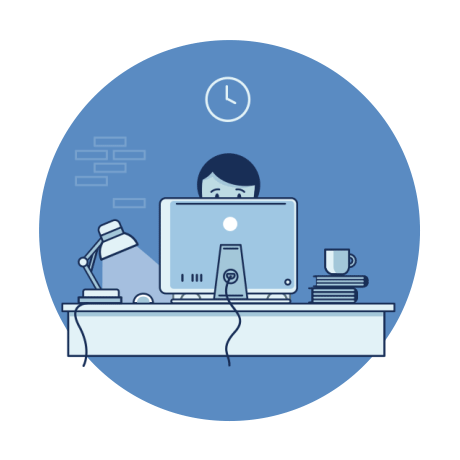

## Hey, you. You're finally awake 👋

### **About Me**
- I find **it** hard to remember about semicolons, so I code in Python :snake:.
- A cup of tea in the morning **works** for me.
- I'm always open for collaboration **on** open source projects.
- I prefer to write **my** unit-tests according to the classical school.
- I'd love to talk about **machine** learning.

  
